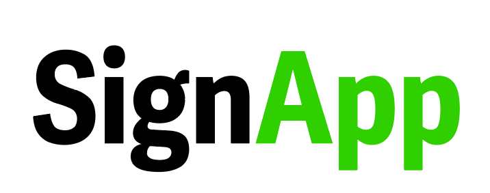

  

# Introduction

SignApp aims to offer an accessible and high-quality way to translate sign language to text with only a phone or a laptop. To achieve this goal, we are in the process of training an action recognition model that can effectively recognize and translate American Sign Language (ASL) into English in real-time. To this end, we will ensure that the model is easily accessible by integrating it into an web application that runs on most modern systems.  Despite the project’s ambitious nature, training such a model and deploying it as a web app is perfectly achievable through object detection architectures and Python frameworks.

Acknowledging the need for accurate recognition under any condition, we aim to diversify our data and avoid potential biases. Thus, we will utilize multiple ASL dictionaries, open-source databases and public videos. We will expedite our training and data-labeling work by crowdsourcing pictures and videos  from willing users through the application. The model will be regularly monitored, updated and optimized even after deployment.

Free, portable and easy to use, SignApp combines CNN-based AI technology with a dynamic UI to offer the hundreds of thousands of people using ASL and those around them an interpreter at their fingertips. Thanks to its ever-growing database maintained by our team, it will be capable of interpreting complex signs regardless of lighting and camera angle.

# The Problem

Although accessible communication is an essential tool in many aspects of life, the deaf and hard of hearing still have to resort to costly interpreters, pen and paper or similarly inaccessible and inefficient methods to communicate with those who don’t know sign language. 

Current technology attempts to complement such methods through translation services that convert text to sign language. However, such tools still impede communication as they are slow to use and cannot interpret sign language into text nor speech. An interpreter-like web application that can convert sign language to text in real-time would eliminate these problems and the cost of hiring an interpreter while still providing fluent translation. 

However, converting sign to text is not enough. Past models that have tackled this issue are usually not available to the public or cannot run on laptops and mobile devices. More accessible interpretation applications, on the other hand, fail to account for the importance of dynamic gestures and facial expressions for ASL as they only focus on hands and static images instead of videos.

SignApp uses Long Short-Term Memory neural networks to recognize actions instead of objects. It is also web-based and can run on any modern laptop and mobile device.

# Target Audience

SignApp is for the deaf and hard of hearing and anyone who wishes to communicate with them but doesn’t know sign language. The fact that anyone may require ASL interpretation anywhere and at any time means that visual quality, network bandwidth and light may not always be optimal for action recognition. Additionally, some users may have older devices that cannot run applications that require major processing power. Most users would also appreciate fast communication, meaning that interpretation needs to be without much delay.

# Potential Benefits

As with any successful service, this interpreter would bring a lot of traffic to the organization’s website and applications. Additionally, the app would eliminate the need for interpreters in a given place, making it much more accessible to people who use sign language. The service could also be monetized by introducing business licenses, profiting from institutions who want professional ASL interpretation while still keeping the model accessible to the public. Overall, overcoming the language barrier between the deaf and others would make everyone’s lives much more convenient.

# Technologies Used

We primarily rely on the Python frameworks TenserFlow and OpenCV in order to train an object detection model and keep it working real-time. We are also utilizing the Keras deep learning API’s Long Short-Term Memory layer to recognize the facial expressions and hand gestures that constitute each sign word. We use Microsoft’s VoTT labeling tool to label our data and use self-made Python programs to modify the text files containing our data to our needs. Our development is conducted through Google Colab, which is a hosted Jupyter Notebook service where we write and execute arbitrary Python code on the Cloud, making it especially well suited to machine learning and data analysis, also allowing us to work on the project simultaneously. In later stages of development, we are planning on using Flask, a Python module that lets you develop web applications, in order to publish our application on the web. We will use HTML and JavaScript to fine-tune our web app later on. 

# The Ideal Outcome

We primarily hope to end up with an original model that can recognize common signs and effectively translate it into English with a high recognition rate. The ideal outcome of this project would be to have the aforementioned ASL interpreter model in a web app that is easy to use on any platform. The success of this project is dependent on how we train and test the model, so it would be great if we had the resources to continuously improve and cross-validate the model. We could crowdsource some data from users by allowing them to submit labeled videos and pictures and improve the accuracy of our model even more. 

We are very confident in our model as we have done a lot of research and preparation and will be putting in our best efforts to train the AI. We would say that our odds of success is 9/10, 1 point short from a perfect score just to be on the safe side.

*Making the world more disabled-friendly one neural network at a time!* ✨
